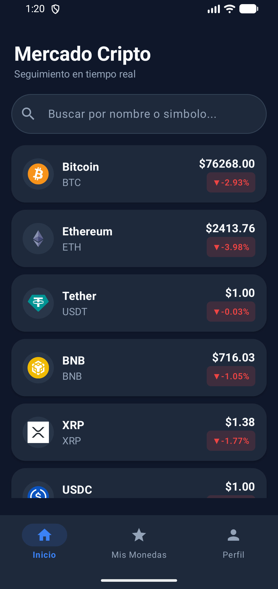
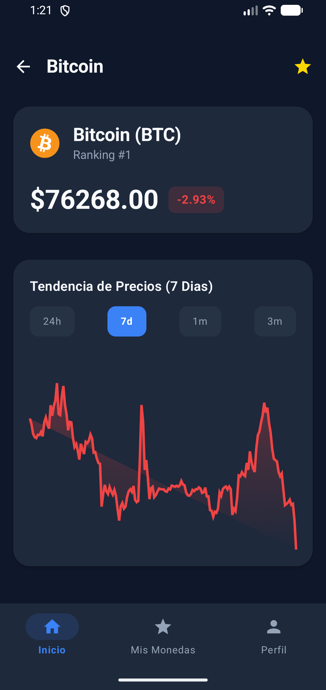
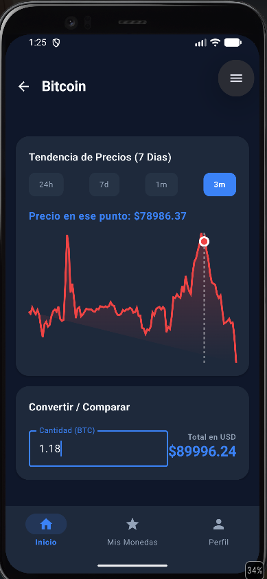
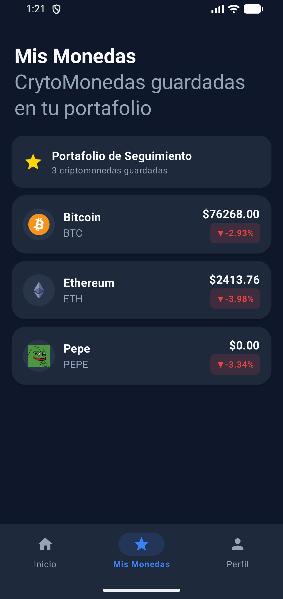
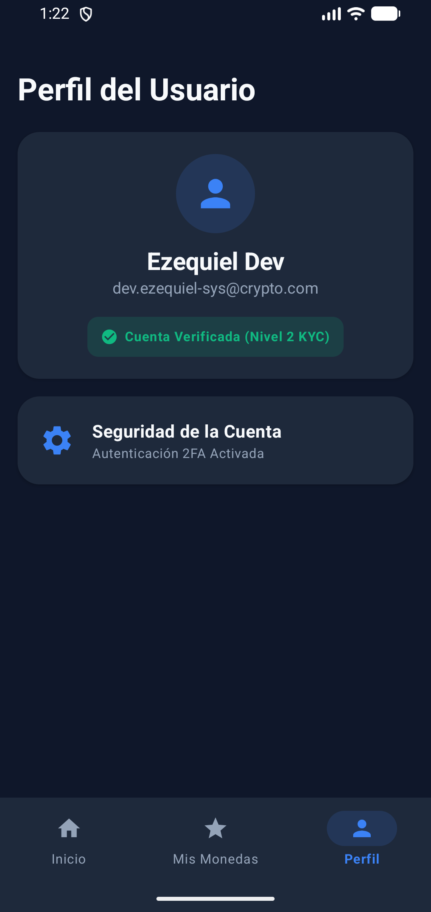
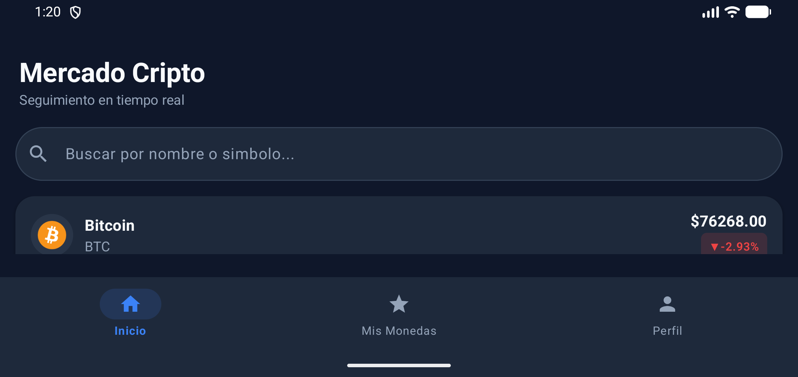

# 🪙 CryptoTracker App


-red?style=for-the-badge)

**CryptoTracker** es una aplicación nativa de Android desarrollada desde cero en **Kotlin** y **Jetpack Compose (Material Design 3)** para el seguimiento de criptomonedas en tiempo real. Aplica las mejores prácticas de la industria con un enfoque **Offline-First**, gráficos de precios interactivos dibujaados en **Canvas 2D** y arquitectura **Clean + MVVM + UDF**.

---

## 📱 Capturas de Pantalla

| Pestaña Inicio (Mercado) | Detalle de la Moneda | Gráfico Interactivo & Conversor |
|:-----------------------:|:-------------------:|:------------------------------:|
|  |  |  |

| Mis Monedas (Favoritos) | Perfil & Verificación KYC | Pantalla Horizontal (Landscape) |
|:----------------------:|:------------------------:|:------------------------------:|
|  |  |  |

---

## 🔥 Características Principales

* ⚡ **Seguimiento en Tiempo Real**: Consumo de la API pública de CoinGecko con información de precios, variaciones en 24h, ranking y logos oficiales.
* 🌐 **Estrategia Offline-First (Room DB)**: Toda la información consumida de la red se almacena localmente en SQLite/Room mediante `@TypeConverters`. La aplicación funciona **100% en Modo Avión** sin conexión a internet.
* 📈 **Gráfico Interactivo de Precios (`Canvas 2D`)**:
    * Curvas de precios personalizadas con degradados de área.
    * Selector de intervalos de tiempo (`24h`, `7d`, `1m`, `3m`).
    * **Interacción Táctil (Scrubbing)**: Al deslizar el dedo sobre el gráfico, se despliega una línea vertical punteada que muestra el precio exacto en ese punto.
* 🧮 **Calculadora / Conversor Cripto a USD**: Conversión de montos de criptomoneda a dólares en tiempo real con validación decimal.
* 🔍 **Búsqueda y Filtrado en Tiempo Real**: Filtrado reactivo sin latencia por nombre o símbolo (`BTC`, `Solana`, etc.) con vista de estado vacío.
* 🧭 **Navegación Tipo-Segura (Type-Safe Navigation 2.8+)**: Navegación entre pantallas mediante objetos y clases de Kotlin anotados con `@Serializable`.
* ⭐ **Mis Monedas (Favoritos Persistentes)**: Marcado/desmarcado de monedas favoritas con actualización en tiempo real en la base de datos local.
* 👤 **Perfil de Usuario**: Pantalla con avatar de usuario, e-mail y badge de **Insignia de Cuenta Verificada KYC Nivel 2**.

---

## 🛠️ Stack Tecnológico y Arquitectura

### 🏛️ Patrón de Arquitectura: Clean Architecture + MVVM + UDF
```text
com.cursokotlin.crypto_tracker_app/
│
├── core/                         <-- Módulos de Hilt (Network/Database), Navegación y Utilidades
│   ├── data/                     <-- safeCall y manejador de excepciones
│   ├── di/                       <-- NetworkModule, DatabaseModule, RepositoryModule
│   ├── navigation/               <-- Route, BottomBarTab, BottomNavigationBar
│   └── util/                     <-- Result, NetworkError
│
├── crypto/                       <-- Feature principal de Criptomonedas
│   ├── data/                     <-- CoinGeckoApi, DTOs, Room DAO/Entity, Mappers
│   ├── domain/                   <-- CryptoCoin (Modelo de Dominio), CoinRepository (Interfaz)
│   └── presentation/             <-- UI con Jetpack Compose
│       ├── coin_list/            <-- CoinListScreen, CoinListViewModel, UiState & UiEvent
│       ├── coin_detail/          <-- CoinDetailScreen, LineChart (Canvas), CryptoConverterCard
│       ├── favorites/            <-- FavoritesScreen
│       └── profile/              <-- ProfileScreen
│
└── ui/theme/                     <-- Material Design 3 Colors, Type & Theme

📚 Librerías Utilizadas
•
Lenguaje: Kotlin 2.0+ con Corrutinas & Flow.
•
UI: Jetpack Compose con Material Design 3.
•
Inyección de Dependencias: Dagger Hilt 2.52.
•
Red / API: Retrofit 2 + OkHttp 4 + Gson Converter.
•
Base de Datos Local: Room 2.6+ con KSP (Kotlin Symbol Processing).
•
Carga de Imágenes: Coil 3.0 AsyncImage.
•
Navegación: Navigation Compose 2.8.5 + Kotlinx Serialization.
🚀 Requisitos e Instalación
•
Android Studio: Ladybug / Meerkat (2024.2.1+) o superior.
•
JDK: Java 17.
•
Min SDK: 24 (Android 7.0) | Target SDK: 35 (Android 15).
Shell Script
# Clonar el repositorio
git clone https://github.com/canoezequiel7k-sys/crypto_tracker_app.git

# Abrir el proyecto en Android Studio y ejecutar en emulador o dispositivo físico
✒️ Autor
Desarrollado con pasión por Ezequiel-sys Dev 🚀

---

